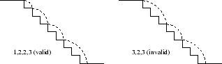
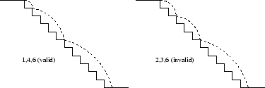
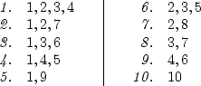

## Use calculate the number of paths for a ball bouncing down a flight of stairs.

### Overview

You got a small rubber ball for your birthday. This ball is particularly bouncy, which makes it great fun for throwing down a flight of stairs.

On each bounce, the ball may jump over one step or it may jump over several steps. The ball never loses momentum, so each bounce must jump over at least as many steps as the previous bounce. In the illustration below, the left hand diagram shows a valid passage down eight steps, whereas the right hand diagram shows an invalid passage down eight steps.



The path of the ball down the flight of stairs can be represented as a sequence of positive integers, with each integer representing the number of steps that are jumped over on a single bounce. Thus the left hand diagram above can be represented by the sequence `1, 2, 2, 3`, and the right hand diagram above can be represented by the sequence `3, 2, 3`.

Note that the final bounce must be exactly the right length to reach the bottom of the staircase. For example, for a staircase of eight steps, the sequence `3, 4, 5` is invalid since the final bounce covers more steps than are available. The sequence `3, 4, 1` is also invalid since, even though it covers the correct amount of steps, the final bounce is smaller than the bounce before it.

Some balls are in fact so bouncy that they accelerate as they make their way down the stairs. If a ball has acceleration `a`, each bounce must jump over at least `a` more steps than the previous bounce. For example, if a ball with acceleration `2` makes its way down a flight of 11 stairs, it may follow the path `1, 4, 6` but it may not follow the path `2, 3, 6`. Both of these paths are illustrated below.



Your task is to write a program that, given the acceleration of the ball a and the length of the flight of stairs `n`, returns the number of valid paths the ball can take to cover the flight.


### Function Signature

```
/**
 * Calculates the valid number of paths a bouncing ball can take down a flight of stairs.
 *
 * @param {Number} n - The length of the flight of stairs.
 * @param {Number} a - The acceleration value for the ball.
 * @returns {Number} - The total number of distinct, valid paths.
 */
function calculateBouncePaths(n, a) {
    
}
```


### Example

* For `n = 10` and `a = 1`, the output should be `10`.

Here are all possible valid paths the ball can take:




### More Examples

* For `n = 10` and `a = 10`, the output should be `1`.
* For `n = 10` and `a = 3`, the output should be `4`.
* For `n = 10` and `a = 0`, the output should be `42`.


### Constraints

* `1 ≤ n ≤ 120`
* `0 ≤ a ≤ n`
* 4 second time limit (given the previous constraints)


### Required

* A JavaScript function that solves the problem.
* Unit tests that demonstrate your solution is correct.
